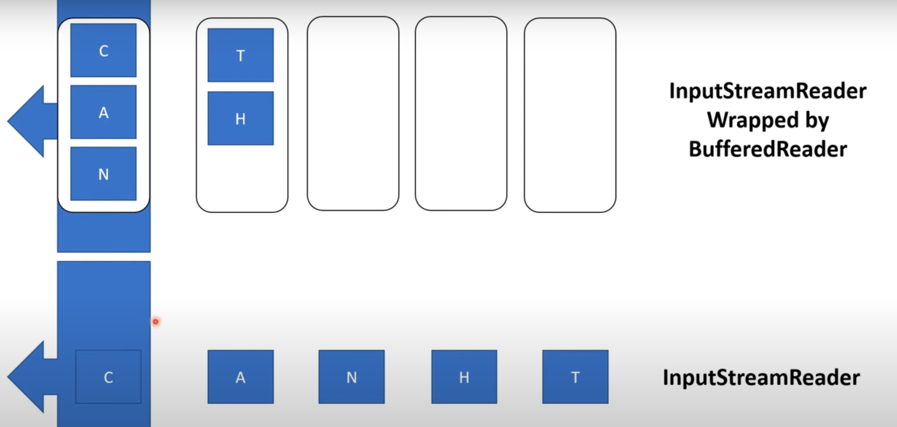

# Java Streams Guide

## 🔹 What is a Stream?
A **stream** is a sequence of data used for reading from or writing to data sources (files, memory, network).

---

## 🔸 Types of Streams

### 1. Character Streams
- For **text-based data** (e.g., `.txt` files)
- Classes end with: `Reader`, `Writer`
- Example: `InputStreamReader`, `BufferedReader`

### 2. Byte Streams
- For **binary data** (e.g., images, videos)
- Classes end with: `InputStream`, `OutputStream`
- Example: `FileInputStream`, `ObjectOutputStream`

---

## 🔗 Bridge Between Streams

- `InputStreamReader`: Converts byte stream → character stream
- `OutputStreamWriter`: Converts character stream → byte stream

---

## ⚡ Buffering for Performance

Instead of reading/writing one byte/char at a time, use **buffered streams**:
- `BufferedReader` / `BufferedWriter` (character)
- `BufferedInputStream` / `BufferedOutputStream` (byte)

Improves performance by processing **blocks of data**.

---

## 💧 Flushing the Buffer

- Buffered output doesn’t write immediately.
- Data is sent when buffer is full.
- Use `.flush()` to force data out **now**.

Use `.flush()` when:
- You need immediate output
- Before closing the stream
- In real-time communication

## Here is an image for clarification:
The content of the buffer, when full, get flushed to the InputStreamReader which then get flushed to the underlying InputStream

---

## Scanner:
Scanner to take input from console. 
System.in is an InputStream that is connected to keyboard input

## Note:
BufferWriter.newLine() 
adds \n because nextLine doesn't return a line separator

accept() method of the serverSocket class waits for a client connection , one connected a socket object is returned that can be used to communicate with the client
Dealing with multiple users, you will need a specific socket for every connection
that's what accept returns 

so the server socket it's just for listnening for connections